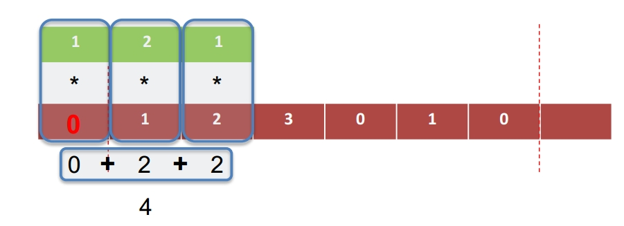
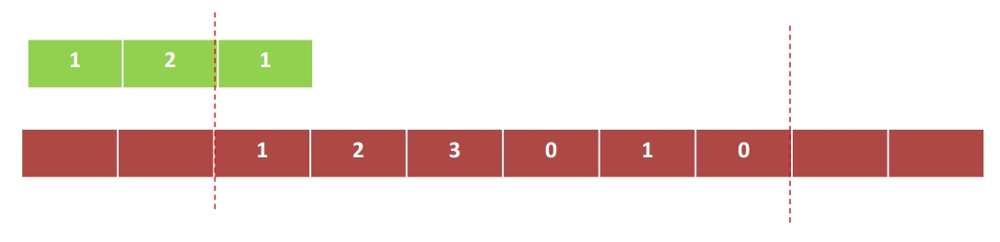

## 一、卷积/卷积核

**卷积**是两个信号之间的运算。
**卷积运算**的本质：卷积核从左到右滑过信号，每滑动一次(一次可以滑动的格数/距离是一个超参数)做一次点积运算。

**输入数据**有多少通道，**卷积核**也相应的有多少个通道；说明各通道之间不是权值共享的。

有多少个卷积核就有多少个特征图(Feature Map)???

## 二、填充方式(以一维卷积为例)

### 1、常用padding

#### ①valid--卷积核*完全*在信号内

#### ②same--卷积核*中心*在信号内

    

#### ③full--卷积核*边沿*在信号内

## 三、多通道数据如何进行卷积

之前讨论的内容默认都是在单通道数据上进行的，但CNN在图像相关任务中，多数情况下的输入是3通道的RGB数据，并且在各层卷积过程中也会因为卷积核的数量输出相应数量的Feature Map作为下一隐藏层的输入，也就是说整个网络中各层输入数据的channel数量可能是不一样的，并且多数情况下不会是单通道的，那么针对这种情况，卷积核如何设计？卷积核又是如何在输入的多通道数据上进行卷积操作？

## 四、特征图(Feature Map)

